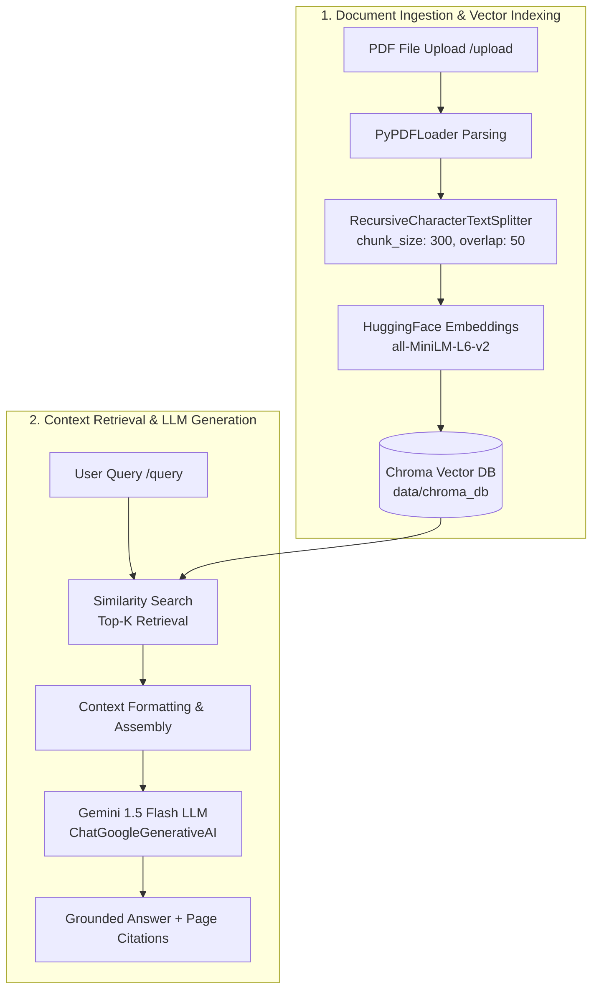

# ⚡ Multi-Modal RAG Document Agent

[](https://www.python.org/)
[](https://fastapi.tiangolo.com/)
[](https://www.langchain.com/)
[](https://www.trychroma.com/)
[](https://ai.google.dev/)
[](LICENSE)

An enterprise-grade **Retrieval-Augmented Generation (RAG) Agent Backend** engineered with **FastAPI**, **LangChain**, **ChromaDB**, and **Google Gemini 1.5 Flash**. 

This system ingests PDF documents, performs semantic text chunking, generates local embeddings, and persists them into a vector database. It enables high-precision, context-grounded Question Answering (QA) complete with page-level metadata citations and relevance scoring.

**[🔗 Live Demo](https://rag-doc-agent.vercel.app/)**


---

## 🌟 Key Features

* 📄 **Automated PDF Ingestion:** Upload and process multi-page PDF documents on-the-fly via async REST endpoints.
* 🧩 **Semantic Character Chunking:** Utilizes LangChain's `RecursiveCharacterTextSplitter` (chunk size: 300, overlap: 50) to optimize context granularity for vector retrieval.
* 🧠 **Local Vector Embeddings:** Computes dense vector embeddings locally using `sentence-transformers/all-MiniLM-L6-v2` via HuggingFace—eliminating external embedding API costs and latency.
* 💾 **Persistent ChromaDB Storage:** Automatically indexes vector embeddings in a persistent local directory (`data/chroma_db/`) for fast, reusable similarity search.
* 🤖 **Grounded Gemini 1.5 Flash QA:** Employs a strict zero-hallucination prompt template backed by Google Gemini to ensure answers are derived exclusively from uploaded documents.
* 📍 **Traceable Source Citations:** Every query response provides itemized source metadata, including document filename, page number, and similarity relevance scores.
* 🔌 **CORS-Ready API:** Native FastAPI architecture pre-configured with CORS middleware for seamless integration with frontend frameworks like React, Next.js, or Vue.

---

## 🏗️ System Architecture



---

## 🛠️ Tech Stack

| Component | Technology | Description |
| :--- | :--- | :--- |
| **Framework** | [FastAPI](https://fastapi.tiangolo.com/) | High-performance asynchronous web framework for building APIs |
| **Orchestration** | [LangChain](https://www.langchain.com/) | Framework for developing applications powered by language models |
| **LLM Engine** | [Google Gemini 1.5 Flash](https://ai.google.dev/) | High-speed, multimodal LLM for context-grounded response generation |
| **Embeddings** | [HuggingFace Transformers](https://huggingface.co/) | `sentence-transformers/all-MiniLM-L6-v2` for dense vector generation |
| **Vector Store** | [ChromaDB](https://www.trychroma.com/) | Open-source embedding database with local file persistence |
| **Parser** | [PyPDF](https://pypdf.readthedocs.io/) | Fast PDF reading and text extraction |
| **Server** | [Uvicorn](https://www.uvicorn.org/) | Lightning-fast ASGI server implementation |

---

## 📁 Directory Structure

```text
RAG-Document-Agent/
├── app/
│   ├── __init__.py
│   └── main.py          # FastAPI server, endpoints & RAG pipeline logic
├── data/
│   ├── chroma_db/       # Persistent ChromaDB vector database storage
│   └── uploads/         # Directory for uploaded document files
├── .env.example         # Environment variable template
├── .gitignore           # Git ignore file for security and cleanliness
├── rag_agent_project.ipynb # Jupyter notebook for prototyping & testing
├── README.md            # Comprehensive project documentation
└── requirements.txt     # Project dependencies
```

---

## 🚀 Getting Started

### Prerequisites

* **Python:** 3.10 or higher
* **Google Gemini API Key:** Obtain an API key from [Google AI Studio](https://aistudio.google.com/).

### Installation & Setup

1. **Clone the Repository**
   ```bash
   git clone https://github.com/YOUR_USERNAME/RAG-Document-Agent.git
   cd RAG-Document-Agent
   ```

2. **Create and Activate a Virtual Environment**
   * **Windows (PowerShell / CMD):**
     ```bash
     python -m venv venv
     .\venv\Scripts\activate
     ```
   * **macOS / Linux:**
     ```bash
     python3 -m venv venv
     source venv/bin/activate
     ```

3. **Install Dependencies**
   ```bash
   pip install --upgrade pip
   pip install -r requirements.txt
   ```

4. **Configure Environment Variables**
   Copy the `.env.example` template to `.env` and enter your Gemini API key:
   ```bash
   # Windows PowerShell
   copy .env.example .env

   # macOS / Linux / Bash
   cp .env.example .env
   ```
   Edit `.env`:
   ```env
   GOOGLE_API_KEY=your_actual_gemini_api_key_here
   ```

5. **Run the API Server**
   Start the FastAPI development server using Uvicorn:
   ```bash
   uvicorn app.main:app --reload
   ```
   The API server will run at `http://127.0.0.1:8000`.

---

## 📡 API Endpoint Reference

### Interactive Documentation
Once the server is running, access the auto-generated documentation:
* **Swagger UI:** `http://127.0.0.1:8000/docs`
* **ReDoc:** `http://127.0.0.1:8000/redoc`

---

### 1. Upload & Index PDF Document
Parses the provided PDF file, splits it into semantic chunks, generates embeddings, and indexes them into ChromaDB.

* **Endpoint:** `POST /upload`
* **Content-Type:** `multipart/form-data`

#### Request (cURL)
```bash
curl -X 'POST' \
  'http://127.0.0.1:8000/upload' \
  -H 'accept: application/json' \
  -H 'Content-Type: multipart/form-data' \
  -F 'file=@/path/to/sample_document.pdf'
```

#### Response Example (`200 OK`)
```json
{
  "status": "success",
  "filename": "sample_document.pdf",
  "pages": 12,
  "chunks": 48
}
```

---

### 2. Query RAG Agent
Performs vector similarity search over indexed document chunks, constructs a grounded context prompt, and returns an answer generated by Gemini 1.5 Flash along with citations.

* **Endpoint:** `POST /query`
* **Content-Type:** `application/json`

#### Request Payload
```json
{
  "query": "What are the core obligations under the service agreement?",
  "top_k": 4
}
```

#### Request (cURL)
```bash
curl -X 'POST' \
  'http://127.0.0.1:8000/query' \
  -H 'Content-Type: application/json' \
  -d '{
    "query": "What are the core obligations under the service agreement?",
    "top_k": 4
  }'
```

#### Response Example (`200 OK`)
```json
{
  "query": "What are the core obligations under the service agreement?",
  "answer": "According to Section 3 of the agreement, the service provider is obligated to ensure 99.9% uptime, conduct monthly maintenance, and provide 24/7 technical support.",
  "sources": [
    {
      "source": "sample_document.pdf",
      "page": 3,
      "relevance_score": 0.8421
    },
    {
      "source": "sample_document.pdf",
      "page": 5,
      "relevance_score": 0.7915
    }
  ]
}
```

---

## 🧪 Testing the API with Python

You can test the backend using Python's `requests` library:

```python
import requests

BASE_URL = "http://127.0.0.1:8000"

# 1. Upload a PDF Document
with open("sample.pdf", "rb") as f:
    upload_res = requests.post(f"{BASE_URL}/upload", files={"file": f})
print("Upload Response:", upload_res.json())

# 2. Query the Document Agent
query_payload = {
    "query": "What is the key takeaway of this document?",
    "top_k": 3
}
query_res = requests.post(f"{BASE_URL}/query", json=query_payload)
print("Query Response:", query_res.json())
```

---

## 🛡️ License & Contributing

Contributions, issues, and feature requests are welcome! Feel free to check the [issues page](https://github.com/Hiten1896/RAG-Document-Agent/issues).

Distributed under the **MIT License**. See `LICENSE` for more information.
